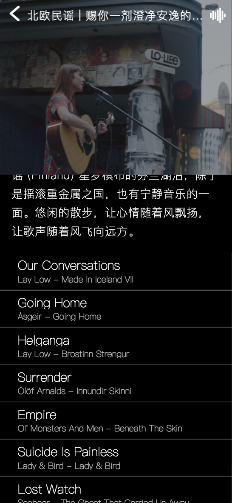

# save-music-app项目总结

## 导言

技术栈：

前端：

 Vue.js+Vuex+Vue-router+Axios

尝试了一门css预编译语言：stylus

后端：

Node.js+Express+MongoDB+Mongoose

项目搭建和打包：

webpack + vue-cli

数据接口：

https://binaryify.github.io/NeteaseCloudMusicApi/

（Node.js版网易云音乐接口）感谢接口的提供者。（非商业用途可以使用）

**界面样式借鉴落网app+Spotify+网易云**，logo是网站在线制作，图标来自于阿里巴巴矢量图标库。

<u>感谢慕课网老师的某音乐APP开发教程，本项目前一半是借鉴了教程中所教的业务逻辑，后半段没有看教程，并且自己独立开发了一些功能。</u>

## 项目demo

在线demo：http://47.107.110.244:8080

服务器慢一些，数据加载不是很快，请见谅。

安卓端观看最好用qq打开链接，没有试过iPhone端是什么情况，我用安卓版uc浏览器打开，音乐URL请求不了，但是用qq打开就可以正常听。电脑端一切正常。

**移动端滚动推荐页面（首页）的时候请触摸空白处（没有文字和图片的地方）**

**冒泡（社区页面）的数据加载的比较慢，因为是从服务器自主搭建的数据库和路由，并且要加载头像图片文件**


展示图：
https://github.com/mingxinZ/savaapp/raw/master/images/%E5%B1%8F%E5%B9%95%E5%BF%AB%E7%85%A7%202019-03-17%2012.14.56%20PM.png


推荐页面也是首页，主要分为音乐杂志（最热歌单）、潮流新碟（最新专辑），两处均为手指滑动的轮播图，点击图片后到达各自的详情页面，有相关图片，文字描述和歌曲列表，点击歌曲可以开始播放，跳转到播放页面。

最后的如诗耳语功能是一个随机推送歌词的功能，数据暂且来自于知乎问题”最让你惊艳的歌词“，被存储在             MongoDB数据库，通过请求获取到后通过洗牌算法随机推送，每次刷新的内容不同并且可以点击下面的‘换一个’进行切换。

左上头部的搜索图标点击后可以到达搜索页面，右上的图标可以到达正在播放的歌曲播放器页面。


点击底部导航栏的发现可以跳转至发现页面，在这里，点击歌手分类，可以调到歌手分类页面。

点击各个关键词可以跳转至各类歌单页面。


点击歌手类别，到达歌手列表页面


点击歌手后到达歌手详情页面。


点击歌曲可以跳转至播放页面。


点击歌单，跳转至歌单详情页面



歌单描述和歌曲列表都可以滚动。点击歌曲跳转至播放页面开始播放歌曲。


点击首页的搜索图标可进入搜索页面。搜索过的条目缓存到搜索历史中，点击右侧垃圾桶可以清空历史，点击热搜可以直接跳到该条目搜索结果页面。


具有搜索建议功能，点击建议条目直接跳转该条目搜索结果页面。


播放器页面，收藏功能和歌曲列表功能暂未开放，所以点击无效。背景是将每首歌曲请求到的图片进行虚化，歌词可以随着时间滚动，随时间当时歌词高亮显示。但是在快速切换歌曲时，可能会出现时间轴对不上导致歌词来回跳转滚动（这个bug还未解决）。

滚动条上的按钮可以拖动，也可以直接点击滚动条的某个部位，直接跳转到歌曲的某个时间。

点击右侧图标可以切换播放模式：当前列表顺序播放、随机播放以及单曲循环。

点击左上的向下箭头，可以将页面隐藏，再去探索别的页面。如果想再进入当前播放页面，只需点击任意页面的右上角那个图标即可。


点击最下方导航栏中的”我的页面“，可以切换至用户页面，目前我的收藏和我的动态功能还没开放，只可以登录，上传头像和退出登录。

点击”请登录“，进入登录页面


登录之前要先注册，点击右下方的”尚未注册？，请注册“，进入注册页面，点击注册。在移动端页面，如果页面高度比较小，尚未注册那句话会上移，点击输入框输入的时候，这句话会继续上移（暂未解决的bug）。

点击注册按钮后，用户名和密码（此处建议密码简单，不要用自己的常用密码，因为MongoDB安全性不好）上传到数据库，以备登录。之后自动跳转至用户页面，点击图像那处可以上传图片做头像，点击白框后就可以选择图片，进度条可以调整放大，点击确定后，再点击上方的”确定就是这个头像了“，自动跳转至用户页面，图像就可以显示了，但是比较慢。


点击最下方导航栏的冒泡，切换至动态页面，点击加号，发表动态。（要有账号之后）


点击发布就可以跳转至冒泡页面，页面上最后就可以显示新动态了，但是由于服务器的慢，这个操作会有点卡，一点时间之后才会显示新动态。

## 遇到问题及解决办法

### 数据接口

一开始是想直接用MongoDB（幸亏没用）去储存一些音乐数据，不过MongoDB操作大量的媒体文件比较麻烦。按照慕课网的教程是从qq音乐jsonp请求获取的，但是那种方法现在行不通，我便用以前就收藏的网易云Node。js接口，这个接口真是十分详细强大了，而且不用跨域。

我将所有的axios的get请求封装在api文件夹中的js文件中。以便统一修改主机名。

### 底部导航栏

一开始我按照教程用的flex布局，但是我想把导航栏放在最底部，所以用定位，但是flex和定位产生了冲突。于是我想到了mint-ui中的tabbar这个组件。但是要修改它的样式，我在node_modules下mint-ui的源码中直接修改了。

### 页面的滚动

教程中的轮播图和页面滚动都用的是老师自己开发的组件better-scroll。我使用的时候在轮播图这个功能上是好使的，但是在页面滚动上不好使。后来我用固定定位和css3的计算属性限制了父容器高度再用overflow-y的scroll属性，加上一个设置内外边距差值的hack隐藏了滚动条。

### 移动端边框变粗

同样的1px在移动端会变粗，因为css的像素是相对，我用了box-shadow的内阴影模仿了细边框。

### mint-ui路由切换

发现router-link并不好使，于是找到了一个办法用router全局对象的push方法。

### 图标图像的加载

字体图标我尝试了一下，但加载不出来，可能因为我不会玩阿里巴巴矢量图标库或者什么别的问题。之后我从阿里巴巴矢量图标库直接下载了图片，放在了当前组件内部的文件夹中，但是加载不出来。后来我找到了方法webpack在解析的时候会先去解析static这个文件下的文件，所以我把所有的图标放在了static这个文件夹下。

### 歌词解析时间轴与歌词内容不匹配

按照教程，我用了老师开发的lyric-parser这个插件来进行歌词的解析与操作，这个插件很强大，但是当时老师在开发的时候应该是基于qq音乐的歌词的数据结构，用来解析网易云接口的歌词时会产生时间轴排序混乱的情况。我去插件的GitHub地址看了issues，发现也有人碰到了同样的问题，他们大多数提议添加一段代码：

```
time: result[1] * 60 * 1000 + result[2] * 1000 + (result[3] || 0) * 10
//把上面一段代码改为下面这句就可以了：
time: result[1] * 60 * 1000 + result[2] * 1000 + (result[3] || 0)
```

我也尝试了这个方法，修改了依赖中的源码。然后发现一开始播放还是可以的，但是播放的多了，还是会出现这个情况。

### 歌词滚动

歌词是这个项目中bug最坑的地方，解决起来比较棘手，到现在体验都不太好。

教程里面还是用的better-scroll，直接引用了封装好的scroll组件，但是我封装的scroll组件一开始用于页面滚动的时候就不好使，让我给删了，所以我没敢再去尝试better-scroll。

于是我用了DOM中的scrollTo方法，这个方法的参数是x坐标和y坐标，我计算了一下坐标值，让歌词的滚动定位到某个位置，然后设置高亮。

### 上线后移动端数据无法获取

第一次上线测试的时候，发现电脑端还好，移动端什么数据都没有，最后发现，是请求的时候，请求的是地址是localhost，要换成主机具体域名，比如： 47.107.110.244才可以请求得到。

### 生产环境下proxyTable发挥不了作用

一开始我把后端数据库接口放在了同一主机下的3000端口，但是发生了跨域。而axios解决不了跨域，于是我用了proxyTable代理，但是在打包上线后发现不好使。后来我了解到proxyTable似乎只适用于开发环境。后来我开始从后端考虑，既然后端接口也是我做的，那我就可以从后端着手，于是我设置了后端可以跨域（通过修改请求头）。

### axios post 请求无法发出

但是我即使设置了所有请求方式包括post都可以跨域，但只有get请求是可用的，axios的post的请求还是发不                                       出去。后来我了解到，axios要设置参数的格式，用自带的qs模块的stringify方法，将传递的参数转换。

### express require body 为空

也就是参数传不过去，后来我发现一开始我用express-generator搭建的后端，没有带body-parser，但是安装了之后并且启用了之后还是一样。后来我了解到还是axios post请求的格式问题，我在全局设置上加上了：

```
Vue.prototype.$axios = axios
axios.defaults.headers.post['Content-Type'] = 'application/x-www-form-urlencoded'
```

### 图像上传           

头像上传是一件有些麻烦的事情，我用了一个vue的图像上传的插件，然后上传了图片的base64编码，在上传的时候改变了后端文件大小的限制。

### 移动端textarea里的文字随着输入自动滚动

后来测试的时候发现在移动端当输入键盘出现的时候，顶部就上移了，这种情况下无法点击发布。于是在父元素中加入一个属性：

```
onresize="document.activeElement.scrollIntoView(true);"
```

之后为了可以在输入的时候自动滚动，我在外面加了一个不定义高度的expand area，然后textarea相对定位，在这个父元素里加入了一个pre元素和span元素，把textarea的内容同步到span里，pre变成块级元素并且设置visibility：hidden让它不可见但是占地方，这样里面的内容就可以自动滚动了。

## 项目总结

### 便利的vuex

vuex在数据切换比较复杂的项目中体现的作用会很大。操作起来简单，使用起来便捷。配合watch使用，不断更改数据请求，更新页面。

### flex布局

移动端是有各种屏幕尺寸的如果用定位的话，在屏幕变换之后可能会变得不再美观，所以flex布局在移动端下显得尤为便利。

### 最后总结

通过这个项目，初步体验到了开发的乐趣与辛苦。体会到了vuex发挥的作用，和移动端呈现与电脑端的不同，更深入地体会到了后端及前后端的工作原理以及生产环境遇到的问题。

### 参考文章

目前只能列举出在网络收藏夹里的文章。

https://www.w3cplus.com/css3/how-to-use-css3-calc-function.html

CSS3的calc()使用

https://juejin.im/post/58415fee61ff4b006c227c06

移动端实现内滚动的4种方案

https://juejin.im/post/5c471f63518825253315ffe4

新手入坑:Vue-router+Mint-ui路由采坑记之router-view不知道放在哪里?

https://juejin.im/entry/584e427361ff4b006cd22c7c

7 种方法解决移动端 Retina 屏幕 1px 边框问题

https://blog.csdn.net/Mr_YanYan/article/details/78783091

vue 动态加载图片src的解决办法

https://segmentfault.com/a/1190000011715088

如何在vue里面优雅的解决跨域

https://blog.csdn.net/stpeace/article/details/50758282

html textarea 自动在底部滚动的实现方法------终于搞定你
